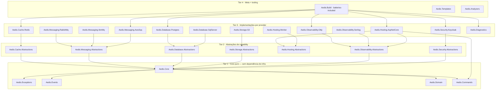

# Arquitetura do Aedis

> Como o Aedis é organizado, por que é organizado assim, e a regra que torna a portabilidade um *package swap*.
> Para o passo-a-passo de extração a partir do framework de origem, veja [MIGRATION.md](MIGRATION.md).

## Classificação

Dizer só "hexagonal" subvende o Aedis — ele opera em **três níveis arquiteturais distintos**:

| Camada | Padrão | No Aedis |
|---|---|---|
| **Domínio & fronteiras** | Hexagonal / Ports & Adapters | `*.Abstractions` (portas) ↔ implementações por provider (adaptadores) |
| **Plataforma & pacotes** | Microkernel / Plug-in | `Aedis.Core` (kernel estável) + plug-ins substituíveis por *package swap* |
| **Hosting** | Framework IoC / Template Method | `WebApiHost`/`StandaloneApp` invertem o controle e entregam o *golden path* |

**Hexagonal no domínio, Microkernel na plataforma.** Clean Architecture e Onion são da mesma família (dependência apontando para o centro) — citáveis, não o rótulo principal.

## A lei do produto: regra de dependência

```
  Domínio / Aplicação  ──depende de──►  Aedis.Core · Aedis.*.Abstractions   (contratos puros)
                                              ▲
  Host / Bootstrap     ──referencia──►  Aedis.*.<Provider>                  (implementação)
   (composition root)                         │ implementa
                                              ▼
                                        Aedis.*.Abstractions
```

1. **Código de domínio e aplicação** referencia **apenas** `Aedis.Core` e `*.Abstractions`.
2. **Apenas o host/composition root** referencia pacotes de implementação concreta.
3. Trocar `Aedis.Cache.Redis` por outro provider **não recompila o domínio**.

> Esta regra é **executável**: `Aedis.Analyzers` (Roslyn) transforma a violação (domínio → implementação) em **erro de build**.

## Topologia de pacotes (tiers)



### Pacotes por tier

**Tier 1 — Core puro (zero dependência de infra):**

| Pacote | Responsabilidade |
|---|---|
| `Aedis.Core` | `Result`/`Error`, primitivos, utilitários, geração de id |
| `Aedis.Exceptions` | Taxonomia de exceções (tipos agnósticos) |
| `Aedis.Events` | CloudEvents v1.0 |
| `Aedis.Domain` | `AggregateRoot`, `Specification`, `Strategy`, `Chain`, `Saga` |
| `Aedis.Commands` | CQRS (commands, handlers, executor, decorators) |

**Tier 2 — Abstrações de capability (dependem só de Core):**

`Aedis.Cache.Abstractions` · `Aedis.Messaging.Abstractions` · `Aedis.Database.Abstractions` · `Aedis.Storage.Abstractions` · `Aedis.Hosting.Abstractions` · `Aedis.Observability.Abstractions` · `Aedis.Security.Abstractions` · `Aedis.Excel.Abstractions` · `Aedis.Pdf.Abstractions`

**Tier 3 — Implementações por provider (só o host referencia):**

| Capability | Pacotes |
|---|---|
| Cache | `Aedis.Cache.Redis` |
| Messaging | `Aedis.Messaging.RabbitMq` · `.IbmMq` · `.AwsSqs` |
| Database | `Aedis.Database.Postgres` · `.SqlServer` |
| Storage | `Aedis.Storage.S3` *(+ `.AzureBlob`, `.Gcs` no roadmap)* |
| Observability | `Aedis.Observability.Serilog` · `Aedis.Observability.Otlp` |
| Hosting | `Aedis.Hosting.AspNetCore` · `Aedis.Hosting.Worker` |
| Scheduling | `Aedis.Scheduling.Hangfire` |
| Security | `Aedis.Security.Keycloak` *(+ `Secrets.Vault`/`.AwsSecretsManager` no roadmap)* |
| Diagnostics | `Aedis.Diagnostics` (health checks zero-config) |
| Documentos | `Aedis.Excel.MiniExcel` · `Aedis.Pdf.QuestPdf` |

**Tier 4 — Meta + tooling:**

| Pacote | Papel |
|---|---|
| `Aedis.Build` | Meta-pacote *batteries-included* (cura uma stack padrão) |
| `Aedis.Templates` | `dotnet new aedis-api` / `aedis-worker` / `aedis-lib` |
| `Aedis.Analyzers` | Roslyn — impõe a regra de dependência em build |

## A fronteira fina: contrato vs. *glue* do host

Nem tudo de uma pasta vai para o mesmo tier. **Regra prática: se referencia `Microsoft.AspNetCore.*`, não é Tier 1/2.**

| Item | Contrato (T1/T2) | *Glue* específico do host (T3) |
|---|---|---|
| Erros | tipos em `Aedis.Exceptions` | mapeamento → RFC 9457 ProblemDetails em `Aedis.Hosting.AspNetCore` |
| Health checks | contrato da checagem | registro no pipeline em `Aedis.Diagnostics` |
| Validação | regras em `Aedis.Validation` | auto-discovery FluentValidation em `Aedis.Hosting.AspNetCore` |

## Experiência do consumidor — o *swap* na prática

```xml
<!-- Domain.csproj — depende SÓ de abstrações -->
<PackageReference Include="Aedis.Core" Version="1.0.0" />
<PackageReference Include="Aedis.Messaging.Abstractions" Version="1.0.0" />

<!-- Host.csproj — escolhe a implementação. Portar = trocar ESTA linha -->
<PackageReference Include="Aedis.Messaging.RabbitMq" Version="1.0.0" />
<!-- migração para AWS:  ↑ trocar por  Aedis.Messaging.AwsSqs -->
```

```csharp
// composition root — a única mudança ao portar
services.AddAedisMessaging().WithRabbitMq(config);   // → .WithAwsSqs(config)
```

Quem quer velocidade usa o meta-pacote **`Aedis.Build`** (*batteries-included*); quem quer controle compõe pacote a pacote (*opt-in complexity*).

## Governança técnica

- **Central Package Management** (`Directory.Packages.props`) — versão única ancorada por `Aedis.Core`.
- **Versionamento:** *lockstep* para Core/Abstractions (uma linha semver); implementações iteram livres acima do piso de Core.
- **`Microsoft.DotNet.ApiCompat`** no CI — barra quebra de contrato silenciosa.
- **`NetArchTest`** nos templates — conformidade arquitetural por serviço.
- **SourceLink + build determinístico + assinatura de pacote + SBOM** — *supply-chain trust* (ver [SECURITY.md](https://github.com/aedis-build/.github/blob/main/SECURITY.md)).
